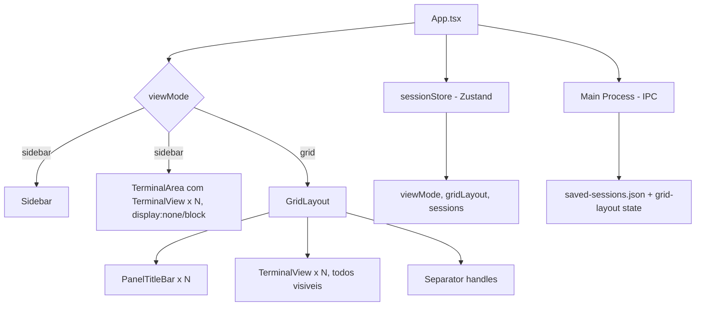

# Grid Layout Design

**Spec**: `.specs/grid-layout/spec.md`
**Status**: Approved

---

## Architecture Overview

O layout atual (`main-layout`) é um flex row com sidebar (`flex-shrink: 0`) + `terminal-area` (`flex: 1`). No modo grid, a sidebar é ocultada e a `terminal-area` é substituída por um componente `GridLayout` baseado em `react-resizable-panels` com `Group`/`Panel`/`Separator` aninhados. A auto-tile gera a estrutura de grupos programaticamente conforme o número de sessões.



**Modos coexistem**: `viewMode: 'sidebar' | 'grid'` no Zustand store. Cada modo renderiza um sub-tree diferente dentro do `main-layout`. Terminais são reutilizados em ambos os modos (o Map global `terminals` persiste).

---

## Code Reuse Analysis

### Existing Components to Leverage

| Component            | Location                              | How to Use                |
| -------------------- | ------------------------------------- | ------------------------- |
| `TerminalView`       | `src/components/TerminalView.tsx`     | Renderizar uma instância por painel do grid. Remover dependência de `display:none/block` `active` para visibilidade: no grid, todos visíveis; o `active` serve apenas para foco/indicadores. |
| `sessionStore`       | `src/store/sessionStore.ts`           | Adicionar campos `viewMode`, `gridLayout`, `setViewMode`, `setGridLayout`. Manter toda lógica existente intacta. |
| `Sidebar`            | `src/components/Sidebar.tsx`          | Adicionar botão de toggle grid. Reaproveitar padrão de resize handle para referência (não usar diretamente). |
| Sidebar resize handle | `src/components/Sidebar.tsx:141-162` | Padrão de mouse-down/move/up com listeners no `document` e `userSelect: 'none'` no body — serve de referência para o drag-and-drop dos painéis. |
| `schedulePersist`     | `electron/main.ts:1022-1033`         | Extender para também persistir o `gridLayout` state. |
| `saveWindowSessionState` | `electron/main.ts:985-1017`      | Adicionar `gridLayout` ao payload de `saved-sessions.json`. |
| `getSavedSessions`   | `electron/main.ts:2655-2659`          | Retornar também o grid layout state no restore. |
| `SearchAllTerminals` | `src/components/TerminalView.tsx`     | Reusar sem alterações — busca global funciona sobre o Map global. |
| `NewSessionModal`    | `src/components/NewSessionModal.tsx`  | Sem alterações — funciona igual nos dois modos. |
| `SessionInfoPanel`   | `src/components/SessionInfoPanel.tsx` | Adicionar prop `variant: 'inline' | 'overlay'`. No grid, renderizar como overlay absoluto sobre o painel ativo. |
| `ContextCircle`      | `src/components/ContextCircle.tsx`    | Reusar no PanelTitleBar para o painel com foco. |

### Integration Points

| System                 | Integration Method                                      |
| ---------------------- | ------------------------------------------------------- |
| `sessionStore` (Zustand) | Adicionar `viewMode`, `gridLayout`, e actions. Sem quebrar subscribers existentes. |
| IPC (`preload.ts`)     | Expor `saveGridLayout(layout)` e `getGridLayout()` ou estender `saved-sessions`. |
| `TerminalView`         | Refatorar `active` para não controlar visibilidade no grid; adicionar prop `variant: 'tab' | 'grid'`. |
| `App.tsx` keyboard     | `Cmd+1-9` já navega entre sessões — no grid, mapear índices para posições no grid. |

---

## Components

### 1. GridLayout

- **Purpose**: Componente raiz do modo grid. Constrói a árvore de `Group`/`Panel`/`Separator` aninhados conforme o algoritmo de auto-tile.
- **Location**: `src/components/GridLayout.tsx`
- **Interfaces**:
  - `GridLayout(props: { sessions: Session[], activeSessionId: string | null, layout: Layout, onLayoutChange: (layout: Layout) => void, onFocusSession: (id: string) => void, onDropSwap: (fromId: string, toId: string) => void }) => JSX.Element`
- **Dependencies**: `react-resizable-panels` (`Group`, `Panel`, `Separator`), `GridPanel`, `autoTile(sessions)` algorithm.
- **Reuses**: `TerminalView` via `GridPanel`. `sessionStore` para estado.

**Auto-tile algorithm** (`src/utils/autoTile.ts`):

```typescript
function autoTile(count: number, sessionIds: string[]): { cols: number, rows: number, grid: string[][] }`
```

| count | strategy |
|-------|----------|
| 1 | 1×1 |
| 2 | 2 cols × 1 row (horizontal split) |
| 3 | 2 cols: left=1 col×1 row (50%), right=1 col×2 rows (50/50 vertical) |
| 4 | 2 cols × 2 rows |
| 5-6 | 3 cols × 2 rows (preenche por coluna: [A,D],[B,E],[C,F]) |
| 7-8 | 4 cols × 2 rows |
| 9+ | ceil(sqrt(N)) cols, fill left-to-right top-to-bottom |

**Rendering**: Para cada "coluna", cria um `Group` vertical; todos dentro de um `Group` horizontal:
```
<Group direction="horizontal">
  {columns.map((col, i) => (
    <React.Fragment key={i}>
      {i > 0 && <Separator />}
      <Group direction="vertical">
        {col.map((sessionId, j) => (
          <React.Fragment key={sessionId}>
            {j > 0 && <Separator />}
            <Panel id={sessionId} minSize={10}>
              <GridPanel sessionId={sessionId} ... />
            </Panel>
          </React.Fragment>
        ))}
      </Group>
    </React.Fragment>
  ))}
</Group>
```

**CSS**: `.grid-layout { flex: 1; overflow: hidden; }` — substitui `.terminal-area` no `main-layout`.

---

### 2. GridPanel

- **Purpose**: Wrapper de cada célula do grid. Contém `PanelTitleBar` + `TerminalView`. Gerencia indicadores de foco e atividade.
- **Location**: `src/components/GridPanel.tsx`
- **Interfaces**:
  - `GridPanel(props: { sessionId: string, isActive: boolean, isFocused: boolean, onFocus: () => void }) => JSX.Element`
- **Dependencies**: `TerminalView` (com prop `variant: 'grid'`), `PanelTitleBar`, `sessionStore`.
- **Reuses**: `TerminalView` existente.
- **States**: 
  - `focused`: borda colorida (2px `var(--accent-color)`, `box-shadow`) + título destacado
  - `active+unread`: indicador sutil de atividade (pulsação suave na borda, opacidade reduzida do accent-color)
  - `idle`: sem destaque
  - `inactive+working`: indicador de spinner no título

**CSS classes**: `.grid-panel { display: flex; flex-direction: column; height: 100%; border: 2px solid transparent; border-radius: 6px; transition: border-color 0.2s; }`, `.grid-panel.focused { border-color: var(--accent-color); box-shadow: 0 0 8px rgba(56, 189, 248, 0.3); }`, `.grid-panel.activity { border-color: var(--accent-color); opacity: 0.4; }`

---

### 3. PanelTitleBar

- **Purpose**: Barra superior de cada painel exibindo nome da sessão, indicadores de status, e servindo como alça de drag-and-drop.
- **Location**: `src/components/PanelTitleBar.tsx`
- **Interfaces**:
  - `PanelTitleBar(props: { sessionId: string, name: string, isFocused: boolean, isRunning: boolean, activityStatus: SessionActivityStatus, contextPercent?: number, onFocus: () => void, onRename: () => void, onDragStart: (e: React.DragEvent) => void }) => JSX.Element`
- **Dependencies**: `ContextCircle` (existente), `sessionStore`.
- **Reuses**: `ContextCircle` para anel de contexto (apenas quando `isFocused`).
- **States**:
  - Normal: nome da sessão + indicador running/stopped (bolinha) + botão info
  - Focused: highlight accent-color + ContextCircle visível
  - Drag: `cursor: grabbing`, opacidade reduzida

**CSS**: `.panel-titlebar { display: flex; align-items: center; padding: 2px 8px; height: 28px; background: var(--titlebar-bg, rgba(0,0,0,0.3)); cursor: grab; user-select: none; font-size: 12px; }`, `.panel-titlebar:active { cursor: grabbing; }`, `.panel-titlebar.focused { color: var(--accent-color); }`

---

### 4. GridToggle

- **Purpose**: Botão na titlebar/sidebar que alterna entre `viewMode: 'sidebar'` e `viewMode: 'grid'`.
- **Location**: Renderizado inline dentro do `titlebar` (App.tsx) e na área de ações da `Sidebar`.
- **Interfaces**: Nenhuma — usa `useSessionStore` diretamente.
- **Dependencies**: `sessionStore.setViewMode()`.
- **Reuses**: Padrão de ícones existente (SVG inline como outros botões da titlebar).
- **UI**: Ícone de grid (4 quadrados) com tooltip "Grid Layout". State indica modo atual.

---

### 5. Extended sessionStore

- **Purpose**: Zustand store estendida com estado do modo de visualização.
- **Location**: `src/store/sessionStore.ts` (modificações inline)
- **New fields**:
  ```typescript
  viewMode: 'sidebar' | 'grid'
  gridLayout: { [sessionId: string]: number }  // flex values, persisted
  ```
- **New actions**:
  ```typescript
  setViewMode: (mode: 'sidebar' | 'grid') => void
  setGridLayout: (layout: { [sessionId: string]: number }) => void
  swapGridPanels: (fromId: string, toId: string) => void  // reorder sessions array
  ```
- **Reuses**: Toda lógica existente de `addSession`, `removeSession`, `setActive` permanece inalterada.

---

### 6. Extended persistence (main process)

- **Purpose**: Salvar e restaurar estado do grid junto com `saved-sessions.json`.
- **Location**: `electron/main.ts` (modificações inline)
- **Changes**:
  - Adicionar `gridLayout?: { mode: 'grid', layout: { [id: string]: number }, activeSessionId: string }` ao tipo `SavedWindowState`.
  - `saveWindowSessionState`: Se `viewMode === 'grid'`, serializar layout + activeSessionId.
  - `getSavedSessions`: Retornar grid state como parte do payload.
  - `session:set-grid-layout` IPC handler: Receber layout state do renderer e persistir via `schedulePersist`.
  - `session:get-grid-layout` IPC handler: Retornar grid state atual.
- **Reuses**: Infraestrutura existente de `schedulePersist`, `loadSavedSessions`, `saveSavedSessions`.
- **Flow**: Renderer chama `window.forgeterm.saveGridLayout(state)` após cada `onLayoutChanged` → debounced persist no main → restore no startup via `window.forgeterm.getGridLayout()`.

---

### 7. TerminalView Refactor

- **Purpose**: Adaptar `TerminalView` para funcionar nos dois modos sem `display:none/block`.
- **Location**: `src/components/TerminalView.tsx` (modificações)
- **Changes**:
  - Nova prop: `variant: 'tab' | 'grid'` (default: `'tab'`).
  - Modo `grid`: terminal sempre visível (`display: block`), `ResizeObserver` gerencia fit automaticamente (já existe).
  - Modo `tab` (atual): comportamento inalterado com `display:none/block` via `active`.
  - Remover `requestAnimationFrame` + `terminal.refresh()` do efeito de ativação no modo grid (desnecessário, terminal nunca fica hidden).
  - `active` prop: no modo grid, controla apenas indicadores de foco e envio de input, não visibilidade.
- **Reuses**: Toda lógica de PTY, xterm.js, addons, resize, tema.

---

## Data Models

### GridLayoutPersistence (main process)

```typescript
interface GridLayoutPersisted {
  mode: 'grid'
  layout: { [sessionId: string]: number }
  activeSessionId: string
}
```

**Storage**: Campo opcional dentro de `SavedWindowState` em `saved-sessions.json`:
```typescript
interface SavedWindowState {
  projectPath: string
  sessions: SavedSession[]
  activeSessionName?: string
  savedAt: number
  gridLayout?: GridLayoutPersisted  // NEW
}
```

### ViewMode (zustand)

```typescript
type ViewMode = 'sidebar' | 'grid'
```

### Session (extended, runtime only)

A interface `Session` no zustand store não muda. A ordem no array `sessions` é usada como ordem de exibição no grid.

---

## Auto-Tile Algorithm Details

```typescript
function autoTile(sessionIds: string[]): string[][] {
  const n = sessionIds.length
  if (n === 0) return []
  if (n === 1) return [[sessionIds[0]]]
  if (n === 2) return [[sessionIds[0]], [sessionIds[1]]]  // 2 cols, 1 row each
  if (n === 3) return [[sessionIds[0]], [sessionIds[1], sessionIds[2]]]  // col0: 1 row, col1: 2 rows
  if (n === 4) return [[sessionIds[0], sessionIds[2]], [sessionIds[1], sessionIds[3]]]  // 2 cols, 2 rows each

  // n >= 5: grid fill by columns
  const cols = Math.ceil(Math.sqrt(n))
  const rows = Math.ceil(n / cols)
  const result: string[][] = Array.from({ length: cols }, () => [])
  for (let i = 0; i < n; i++) {
    result[i % cols].push(sessionIds[i])
  }
  return result
}
```

**Nota**: Para 5+ sessões, `sessionIds` é percorrido em ordem (0→N-1), preenchendo colunas da esquerda para direita. A primeira coluna recebe `[0, 5, 10, ...]`, segunda `[1, 6, ...]`, etc. Isso resulta em preenchimento top-to-bottom dentro de cada coluna, e left-to-right entre colunas — consistente com a spec.

---

## Drag-and-Drop Implementation

Usa HTML5 Drag and Drop API (nativa do browser, sem dependências):

1. **DragStart** (`PanelTitleBar`): `e.dataTransfer.setData('text/plain', sessionId)`, `e.dataTransfer.effectAllowed = 'move'`
2. **DragOver** (`GridPanel`): `e.preventDefault()`, `e.dataTransfer.dropEffect = 'move'`, adiciona classe CSS `.drop-target`
3. **DragLeave** (`GridPanel`): Remove classe `.drop-target`
4. **Drop** (`GridPanel`): Lê `sessionId` do `dataTransfer`, chama `onDropSwap(fromId, toId)`.
5. **Swap**: No store, `swapGridPanels(fromId, toId)` troca as posições no array `sessions` (usando `splice`). O grid re-renderiza com a nova ordem, aplicando auto-tile novamente.

**Estados visuais**:
- Painel sendo arrastado: `opacity: 0.5`
- Painel alvo (hover): `border: 2px dashed var(--accent-color)`, leve brilho
- Sem alvo válido: cursor `not-allowed` no body

---

## Error Handling Strategy

| Error Scenario | Handling | User Impact |
|---|---|---|
| Falha ao salvar layout (disco cheio, permissão) | Log no console, continuar sem persistir. Layout funciona na sessão atual. | Perde o layout ao fechar app, mas funcionalidade intacta. |
| Layout salvo corrompido (JSON inválido) | `try/catch` no `JSON.parse`, fallback para sidebar mode. Log do erro. | App inicia normalmente em sidebar. |
| Sessão do layout restaurado não existe mais | Ignorar a sessão faltante, aplicar auto-tile com as restantes. | Grid inicia com sessões disponíveis. |
| `react-resizable-panels` erro interno (panel abaixo de minSize) | `minSize={10}` (10% flex) em todos os painéis previne. | Sem impacto. |
| Drag-and-drop em grid com 1 sessão | Desabilitado — `PanelTitleBar` não inicia drag. Verificação `sessions.length <= 1`. | Sem ação. |
| ResizeObserver falha (container removido) | Já tratado no `TerminalView` existente (`offsetParent !== null` check). | Terminal não redimensiona, mas continua funcional. |
| Navegação Cmd+1-9 com mais de 9 sessões | Mapear apenas os primeiros 9 (comportamento existente). | Consistente com sidebar. |

---

## Tech Decisions

| Decision | Choice | Rationale |
|---|---|---|
| Biblioteca de grid resizable | `react-resizable-panels` (`/bvaughn/react-resizable-panels`) | Leve (5KB), suporta nested Groups para grid 2D, Layout type com persistência nativa via `defaultLayout`/`onLayoutChanged`, sem dependências extras. Bem mantido (2K+ stars). Alternativas consideradas: `allotment` (menos flexível para nesting), custom CSS grid + resize handles (reinventar a roda). |
| Drag-and-drop | HTML5 Drag and Drop API nativa | Zero dependências. Suficiente para swap de painéis (não precisa de reordenação complexa tipo react-beautiful-dnd). Consistente com Electron/Browser. |
| Persistência | Estender `saved-sessions.json` existente | Manter single source of truth para estado de sessão. Evitar arquivo separado que pode dessincronizar. Campo opcional (`gridLayout?`) não quebra compatibilidade. |
| Toggle sidebar/grid | Botão + estado no Zustand | Zustand reativo — todos componentes observam `viewMode`. Sidebar já usa `useSessionStore`. Botão na titlebar segue padrão de ícones existente. |
| TerminalView visibility | Prop `variant` em vez de lógica no `active` | Evita refatoração de risco no componente mais sensível. Modo `tab` mantém comportamento exato atual. Modo `grid` é aditivo. |
| Auto-tile para 5+ sessões | `ceil(sqrt(N))` colunas, fill por coluna | Padrão comum em grid layouts (ex: macOS Finder icon view). Previsível e determinístico. |
| SessionInfoPanel no grid | Overlay `position: absolute` com `z-index` | Evita redimensionar o grid. Reutiliza a lógica existente de open/close do painel. Fecha ao clicar fora (já existe). |
| Indicadores de atividade em painéis inativos | Pulsação CSS sutil na borda (`@keyframes`) | Leve, não polui. Apenas borda com opacidade reduzida do accent-color + animação de 2s. Zero impacto de performance (GPU acelerado). |

---

## Implementation Order

1. Instalar `react-resizable-panels` e configurar TypeScript
2. Adicionar `viewMode` e `gridLayout` ao `sessionStore`
3. Criar `PanelTitleBar` com indicadores
4. Criar `GridPanel` wrapper
5. Criar `GridLayout` com auto-tile e nested Groups
6. Refatorar `TerminalView` com prop `variant`
7. Integrar `GridLayout` no `App.tsx` (substituir `terminal-area` condicionalmente)
8. Adicionar `GridToggle` na titlebar e sidebar
9. Implementar drag-and-drop (swap de painéis)
10. Extender persistência no main process (`saved-sessions.json`)
11. Adicionar IPC handlers e preload APIs
12. Testar edge cases (fechar/abrir app, corrupção de layout, 1 sessão)
