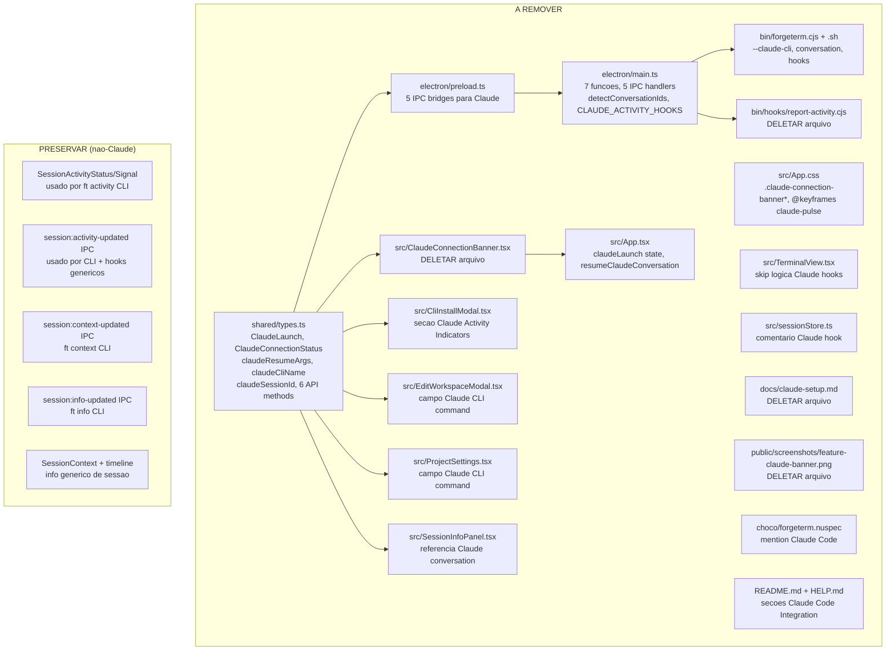

# Remover Integracao com Claude Code — Design

**Spec**: `.specs/remover-integracao-claude-code/spec.md`
**Status**: Draft

---

## Architecture Overview

Remocao total do subsistema Claude Code que se estende por 3 camadas (config, core, UI) e 18 arquivos (207 referencias). Nao ha nova arquitetura — e uma remocao pura de codigo morto.



### O que permanece intacto

O sistema de atividade (`SessionActivityStatus`, `SessionActivitySignal`, `session:activity-updated`, `activity:report`) e preservado porque o CLI `ft activity` tambem o utiliza — nao e exclusivo do Claude. O mesmo vale para `session:context-updated` (`ft context`) e `session:info-updated` (`ft info`), que sao comandos genericos de CLI.

### O que e removido

Apenas o que depende exclusivamente de Claude: deteccao de conversas (`findClaudeSessionIdInTree`, `detectConversationIds`), hooks de atividade (`CLAUDE_ACTIVITY_HOOKS`), configuracao especifica (`claudeCliName`, `claudeResumeArgs`, `dangerouslySkipPermissions`), UI dedicada (`ClaudeConnectionBanner`), e o subcomando `conversation` do CLI.

---

## Code Reuse Analysis

Nao ha reuso — e remocao pura. Os padroes existentes que guiam as edicoes:

| Padrao                    | Localizacao              | Como aplicar                                     |
| ------------------------- | ------------------------ | ------------------------------------------------ |
| IPC handler registration  | `electron/main.ts`       | Remover blocos `ipcMain.handle('claude:*', ...)` |
| Preload bridge pattern    | `electron/preload.ts`    | Remover metodos mantendo estrutura de `ipcRenderer.invoke` |
| Component lifecycle       | `src/components/*.tsx`   | Remover useState/useCallback mantendo imports limpos |
| CSS selector naming       | `src/App.css`            | Remover blocos `.claude-*` e `@keyframes claude-*` |
| Zustand store             | `src/store/sessionStore.ts` | Remover apenas comentarios |
| CLI argument parsing      | `bin/forgeterm.cjs`      | Remover `--claude-cli` do parser |
| Shell CLI case statement  | `bin/forgetterm-cli.sh`  | Remover `conversation)` case e funcoes relacionadas |
| Markdown sections         | `README.md`, `HELP.md`   | Remover secoes "Claude Code Integration" |

### Integration Points (a desfazer)

| Integracao                   | Como desfazer                                       |
| ---------------------------- | --------------------------------------------------- |
| `ClaudeConnectionBanner` → `App.tsx` | Remover import + renderizacao condicional    |
| `ClaudeLaunch` → `App.tsx`   | Remover type import + `resumeClaudeConversation()`  |
| `claudeSessionId` → `SavedSession` | Remover campo da interface + persistencia     |
| `ClaudeLaunch` → `resolveClaudeLaunch()` | Remover funcao e seus callers               |
| `CLAUDE_ACTIVITY_HOOKS` → `~/.claude/settings.json` | Remover instalacao e verificacao |
| `bin/hooks/report-activity.cjs` → Claude hooks | Deletar script e diretorio               |

---

## Secoes de Remocao

### S1: Tipos Compartilhados (`shared/types.ts`)

- **Remover interfaces inteiras**: `ClaudeLaunch`, `ClaudeConnectionStatus`
- **Remover campos de interfaces existentes**:
  - `ForgeTermConfig`: `claudeResumeArgs`, `claudeCliName`, `dangerouslySkipPermissions`
  - `Workspace`: `claudeCliName`, `dangerouslySkipPermissions`
  - `SavedSession`: `claudeSessionId`
- **Remover metodos de `ForgeTermAPI`**: `installClaudeHooks`, `areClaudeHooksInstalled`, `checkClaudeConnection`, `getClaudeSetupPrompt`, `getClaudeLaunch`, `onConversationUpdated`
- **Atualizar comentario em `SessionActivitySignal`**: remover "Claude hooks"
- **Dependencias**: Nenhuma (e a base)
- **Impacto**: Quebra compilacao de todos os arquivos que referenciam esses tipos → corrigir nas secoes seguintes

### S2: Ponte Preload (`electron/preload.ts`)

- **Remover 6 metodos**: `installClaudeHooks`, `areClaudeHooksInstalled`, `checkClaudeConnection`, `getClaudeSetupPrompt`, `getClaudeLaunch`, `onConversationUpdated`
- **Remover import de tipo**: `ClaudeConnectionStatus` (se nao usado em outro lugar)
- **Dependencias**: `shared/types.ts` (S1)
- **Impacto**: `window.forgeterm` perde esses metodos → componentes que os chamam precisam ser limpos

### S3: Processo Principal (`electron/main.ts`)

⚠️ **CONCERNS.md Risk HIGH**: main.ts e um monolito de 3135 linhas. A remocao toca ~60 referencias. Isolar cada bloco de codigo Claude e remove-lo atomicamente.

**Funcoes a remover (7):**

| Funcao                        | Linha | Remover completamente? |
| ----------------------------- | ----- | ---------------------- |
| `resolveClaudeLaunch()`       | 783   | Sim — retorna `ClaudeLaunch` |
| `checkClaudeConnection()`     | 805   | Sim — retorna `ClaudeConnectionStatus` |
| `getClaudeSetupPrompt()`      | 828   | Sim — gera prompt Claude |
| `findClaudeSessionIdInTree()` | 967   | Sim — le `~/.claude/sessions/` |
| `claudeSettingsPath()`        | 2799  | Sim — caminho `~/.claude/settings.json` |
| `areClaudeActivityHooksInstalled()` | 2813 | Sim — verifica hooks |
| `installClaudeActivityHooks()` | 2826 | Sim — instala hooks |

**Constantes a remover:**
- `CLAUDE_ACTIVITY_HOOKS` (linha 2784) — array de config de hooks

**Helpers a remover:**
- `claudeHooksScriptPath()` — caminho do script de hook
- `hasActivityHook()` — verificacao de hook existente

**IPC handlers a remover (5):**

| Channel                     | Handler                          |
| --------------------------- | -------------------------------- |
| `claude-hooks:installed`    | `areClaudeActivityHooksInstalled` |
| `claude-hooks:install`      | `installClaudeActivityHooks`     |
| `claude:check-connection`   | `checkClaudeConnection`          |
| `claude:get-setup-prompt`   | `getClaudeSetupPrompt`           |
| `claude:get-launch`         | `resolveClaudeLaunch`            |

**Alteracoes em funcoes existentes:**
- `detectConversationIds()` — REMOVER por completo (escaneia `~/.claude/sessions/`)
- `saveWindowState()` — remover `claudeSessionId` da persistencia
- `loadWindowState()` — remover logica de restore de `claudeSessionId`
- Bloco de resolucao de `claudeCliName` do config — remover
- Bloco de instalacao de hooks na inicializacao — remover
- `ClaudeConnectionStatus` interface local (linha 798) — remover

**PRESERVAR:**
- `session:activity-updated` sender (linha 228) — mantido, usado pelo CLI
- `activity:report` handler (linha 2649) — mantido, generico
- `session:context-updated` sender — mantido, usado por `ft context`
- `session:info-updated` sender — mantido, usado por `ft info`

### S4: Gerenciador PTY (`electron/ptyManager.ts`)

- **Remover**: 1 comentario sobre "Claude rename" — alteracao trivial
- **Dependencias**: Nenhuma

### S5: Componente Banner (`src/components/ClaudeConnectionBanner.tsx`)

- **Acao**: DELETAR arquivo inteiro
- **Dependencias**: `shared/types.ts` (S1)
- **Impacto**: `App.tsx` importa este componente → remover import e uso

### S6: App Root (`src/App.tsx`)

- **Remover imports**: `ClaudeConnectionBanner`, `ClaudeLaunch`
- **Remover estado**: `claudeLaunch`
- **Remover funcao**: `resumeClaudeConversation()`
- **Remover renderizacao**: `<ClaudeConnectionBanner>` condicional
- **Remover logica de init**: bloco que chama `getClaudeLaunch()` e `resumeClaudeConversation()`
- **Dependencias**: S1, S5

### S7: Estilos (`src/App.css`)

- **Remover seletores**: `.claude-connection-banner`, `.claude-connection-banner-*` (todos)
- **Remover animacao**: `@keyframes claude-pulse`
- **Remover comentarios**: qualquer mencao a "claude" em comentarios CSS
- **Dependencias**: Nenhuma

### S8: Modal de Instalacao CLI (`src/components/CliInstallModal.tsx`)

- **Remover estado**: `claudeHooksInstalled`, `claudeHooksBusy`
- **Remover handler**: `handleClaudeHooksInstall`
- **Remover secao UI**: "Claude Activity Indicators" (botao + status)
- **Remover chamadas API**: `window.forgeterm.areClaudeHooksInstalled()`, `window.forgeterm.installClaudeHooks()`
- **Dependencias**: S1, S2

### S9: Modal de Edicao de Workspace (`src/components/EditWorkspaceModal.tsx`)

- **Remover estado**: `wsClaudeCliName`
- **Remover campo UI**: "Claude CLI command" input
- **Remover logica de save**: nao incluir `claudeCliName` no payload
- **Dependencias**: S1

### S10: Configuracoes do Projeto (`src/components/ProjectSettings.tsx`)

- **Remover estado**: `claudeCliName`
- **Remover campo UI**: "Claude CLI command" input
- **Remover logica de save**: nao incluir `claudeCliName` no payload
- **Dependencias**: S1

### S11: Painel de Info de Sessao (`src/components/SessionInfoPanel.tsx`)

- **Remover referencia**: "Claude conversation" label/texto
- **Remover botao/acao**: resume Claude conversation (se existir)
- **Dependencias**: S1

### S12: Terminal View (`src/components/TerminalView.tsx`)

- **Remover logica de skip**: relacionada a Claude hooks (1 referencia)
- **Dependencias**: S1

### S13: Store Zustand (`src/store/sessionStore.ts`)

- **Remover comentarios**: 2 referencias a "Claude hook" em comentarios
- **Dependencias**: Nenhuma — apenas texto

### S14: CLI Node (`bin/forgeterm.cjs`)

- **Remover flag**: `--claude-cli` do parser de argumentos
- **Remover help**: referencias a `CLAUDE.md` no texto de ajuda
- **Remover comando**: `conversation` (se referenciado)
- **Dependencias**: Nenhuma

### S15: CLI Shell (`bin/forgetterm-cli.sh`)

- **Remover flag**: `--claude-cli`
- **Remover funcao**: `cmd_conversation()`
- **Remover case**: `conversation)` no switch principal
- **Remover help**: referencias a Claude e conversation
- **PRESERVAR**: `cmd_activity()` — usado independentemente do Claude
- **Dependencias**: Nenhuma

### S16: Hooks (`bin/hooks/`)

- **Acao**: DELETAR `bin/hooks/report-activity.cjs`
- **Acao**: DELETAR diretorio `bin/hooks/` se ficar vazio
- **Dependencias**: Nenhuma

### S17: Documentacao (`docs/claude-setup.md`)

- **Acao**: DELETAR arquivo
- **Dependencias**: Nenhuma

### S18: Screenshot (`public/screenshots/feature-claude-banner.png`)

- **Acao**: DELETAR arquivo (41KB PNG)
- **Dependencias**: Nenhuma (referenciado em README.md e HELP.md — remover referencias la)

### S19: Chocolatey (`choco/forgeterm.nuspec`)

- **Alterar descricao**: remover "and Claude Code integration"
- **Dependencias**: Nenhuma

### S20: README (`README.md`)

- **Remover secao**: "### Claude Code Integration" inteira
- **Remover screenshot**: ``
- **Reescrever paragrafos** que mencionam Claude:
  - Linha 47: "Claude Code conversation IDs" → remover mencao
  - Linha 78: "Extra CLI args for Claude resume" → remover
  - Linha 107: exemplo `claudeResumeArgs` no JSON → remover
- **Dependencias**: S18 (screenshot ja deletado)

### S21: HELP (`HELP.md`)

- **Remover secao**: "### Claude Code Integration" inteira
- **Remover screenshot**: referencia a `screenshots/feature-claude-banner.png`
- **Reescrever paragrafos** que mencionam Claude:
  - Linha 86: "Claude Code conversation IDs" → remover mencao
  - Linha 88: "Claude Code sessions are automatically resumed" → remover
  - Linha 114: "configure Claude Code resume args" → remover mencao
  - Linha 194-196: secao "With AI agents (Claude Code, etc.)" → reescrever sem mencionar Claude
- **Dependencias**: S18

---

## Data Models

### Alteracoes em `ForgeTermConfig`

```typescript
// ANTES:
export interface ForgeTermConfig {
  // ... outros campos ...
  claudeResumeArgs?: string[]     // REMOVER
  claudeCliName?: string          // REMOVER
  dangerouslySkipPermissions?: boolean  // REMOVER
}

// DEPOIS: sem os 3 campos acima
```

### Alteracoes em `Workspace`

```typescript
// ANTES:
export interface Workspace {
  // ... outros campos ...
  claudeCliName?: string              // REMOVER
  dangerouslySkipPermissions?: boolean // REMOVER
}

// DEPOIS: sem os 2 campos acima
```

### Alteracoes em `SavedSession`

```typescript
// ANTES:
export interface SavedSession {
  // ... outros campos ...
  claudeSessionId?: string  // REMOVER
}

// DEPOIS: sem o campo acima
```

### Tipos removidos integralmente

```typescript
// REMOVER:
export interface ClaudeLaunch { cliName: string; resumeArgs: string[] }
export interface ClaudeConnectionStatus { connected: boolean; currentVersion: string; promptedVersion: string | null; needsUpdate: boolean }
```

### Metodos removidos de `ForgeTermAPI`

```typescript
// REMOVER:
installClaudeHooks: () => Promise<{ success: boolean; error?: string }>
areClaudeHooksInstalled: () => Promise<boolean>
checkClaudeConnection: () => Promise<ClaudeConnectionStatus>
getClaudeSetupPrompt: () => Promise<string>
getClaudeLaunch: () => Promise<ClaudeLaunch>
onConversationUpdated: (callback: (sessionId: string, conversationId: string) => void) => () => void
```

---

## Error Handling Strategy

| Cenario de Erro | Tratamento | Impacto no Usuario |
| --------------- | ---------- | ------------------ |
| `.forgeterm.json` legado com `claudeResumeArgs`/`claudeCliName` | TypeScript ignora campos extras via `JSON.parse` + type assertion — sem erro | Nenhum — carregamento silencioso |
| `.forgeterm.json` legado com `dangerouslySkipPermissions` | Idem acima | Nenhum |
| `~/.claude/hooks/forgeterm/` existente de instalacao anterior | App nao tenta ler/escrever — diretorio ignorado | Nenhum |
| `~/.claude/sessions/` com sessoes antigas | App nao escaneia — `detectConversationIds()` removido | Nenhum |
| `saved-sessions.json` com `claudeSessionId` em entradas antigas | Campo ignorado no parse (TypeScript nao valida runtime) | Sessoes restauradas normalmente, sem conversation ID |
| Build apos remocoes (`pnpm build`) | Deve passar sem erros. Se falhar: import residual nao removido | Correcao pontual no arquivo com import residual |
| Dev mode apos remocoes (`pnpm dev`) | Deve iniciar sem erros. Se falhar: chamada a metodo `window.forgeterm.*` removido | Correcao no componente que chama metodo inexistente |
| Usuario tinha hooks do Claude instalados e atualiza o app | Hooks ficam orfaos em `~/.claude/settings.json` mas nao causam erro — o script `report-activity.cjs` nao existe mais, entao o hook falha silenciosamente no Claude Code | Nenhum no ForgeTerm; usuario pode limpar `~/.claude/settings.json` manualmente se quiser |

---

## Tech Decisions

| Decisao | Escolha | Justificativa |
| ------- | ------- | ------------- |
| Preservar `SessionActivitySignal` e `session:activity-updated`? | Sim | Usado pelo CLI `ft activity` — nao e exclusivo do Claude |
| Preservar `session:context-updated` e `onContextUpdated`? | Sim | Usado pelo CLI `ft context` — generico |
| Preservar `session:conversation-updated` e `onConversationUpdated`? | Nao | Exclusivo do Claude (tracking de conversation ID) |
| Remover `dangerouslySkipPermissions` do `Workspace`? | Sim | So usado por `resolveClaudeLaunch()` para construir comando de resume |
| Migrar `saved-sessions.json` com `claudeSessionId`? | Nao | TypeScript nao valida runtime — campo extra e ignorado silenciosamente |
| Remover `conversation` do CLI `ft`? | Sim | Sem Claude, nao ha conversation ID para linkar |
| Deletar `bin/hooks/` diretorio? | Sim, se vazio | Apos remover `report-activity.cjs`, diretorio fica vazio |
| Ordem de remocao para manter build compilavel? | Types → Preload → Main → Componentes → CLI/Docs | Quebra dependencias em cascata: remove tipos primeiro, depois consumidores |

---

## Risk Assessment (from CONCERNS.md)

| Risk | Relevance | Mitigation |
| ---- | --------- | ---------- |
| **HIGH: main.ts monolith (3135 linhas)** | Diretamente afetado — ~60 referencias Claude espalhadas pelo arquivo | Isolar cada bloco Claude por funcao/constante. Remover atomica e sequencialmente. Nao refatorar o arquivo — apenas remover codigo Claude |
| **HIGH: No automated tests** | Nao ha testes para validar a remocao | Validacao manual: `pnpm build` + `pnpm dev` + verificacao visual. Buscar `rg -i claude` para confirmar zero residuos |
| **MEDIUM: Session persistence reliability** | `detectConversationIds()` removido → session persistence simplifica (menos estado para reconciliar) | Efeito positivo — remove um ponto de falha |
| **LOW-MEDIUM: App.css single file** | Remocao de ~9 blocos CSS pode deixar seletores orfaos | Cada bloco e autocontido (prefixado `.claude-*`) — sem risco de colateral |
| **LOW: No IPC schema validation** | Remocao de 5 canais IPC reduz superficie | Efeito positivo — menos canais para manter |

---

## Verification Criteria

1. `pnpm build` passa sem erros de compilacao
2. `pnpm dev` inicia o app sem erros de runtime
3. `rg -i claude src/ electron/ shared/` retorna zero resultados
4. `rg -i claude README.md HELP.md` retorna zero resultados relevantes
5. Banner "Claude connection" nao aparece na UI
6. `.forgeterm.json` com campos `claudeResumeArgs`/`claudeCliName` carrega sem erros
7. `node bin/forgeterm.cjs --help` nao mostra `--claude-cli`
8. `bash bin/forgeterm-cli.sh help` nao mostra `conversation`
